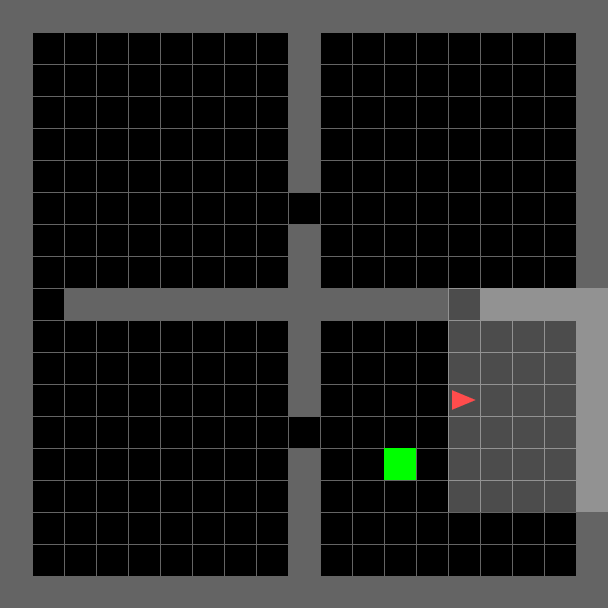

# Minigrid robust state entropy experiments

This repo is based on the paper: Maximum Value-Conditional State Entropy Exploration for Sample-Efficient Deep Reinforcement Learning 

available at https://sites.google.com/view/rl-vcse

(note we do not use the value conditioning in our experiments)

## Installation
Please install below packages in a following order:

### rl-starter-files

```
cd Minigrid_robust_rl
conda env create -f environment.yml
conda activate vcse_env
cd rl-starter-files/rl-starter-files/
pip install -r requirements.txt
conda install -c conda-forge "gym>=0.18.0,<0.19.0"
```

### gym_minigrid

```
git clone https://github.com/Farama-Foundation/Minigrid.git
cd Minigrid
git checkout 116fa65bf9584149f9a23c2b61c95fd84c25e467
pip3 install -e .
pip install minigrid
```

### torch-ac

```
cd torch-ac
pip3 install -e .
```

### pytorch

```
conda install pytorch torchvision torchaudio pytorch-cuda=11.7 -c pytorch -c nvidia
```
### wandb
```
pip install wandb
```
## Reproducing our main results

### Tutorial: Running Experiments
To train and evaluate the agents, navigate to the project directory and run the A2C execution script:

```bash
cd State_entropy_robust_rl/Minigrid_robust_ent
bash run_a2c.sh
```

This script trains and evaluates three variants:
1. **No regularization** (Baseline, $\beta=0.0$)
2. **Policy-entropy regularization**
3. **State-entropy regularization** (Novelty-Seeker, $\beta=0.07$)

If you are logged in to Weights & Biases (`wandb login`), all metrics and plots will be uploaded automatically.

## Results Showcase (Seed 1)

### Visual Performance (Deterministic)
The following visualizations show the agents' performance using deterministic action selection (`--argmax`) on Seed 1.

| Novelty-Seeking ($\beta=0.07$) | Baseline ($\beta=0.0$) |
| :---: | :---: |
|  |  |

### Training Metrics
Final performance metrics after 3.0M frames of training (Mean value over parallel environments):

| Variant | Mean Return | Mean Frames per Episode |
| :--- | :---: | :---: |
| **Novelty ($\beta=0.07$)** | **0.655** | **36.5** |
| Baseline ($\beta=0.0$) | 0.545 | 50.5 |
